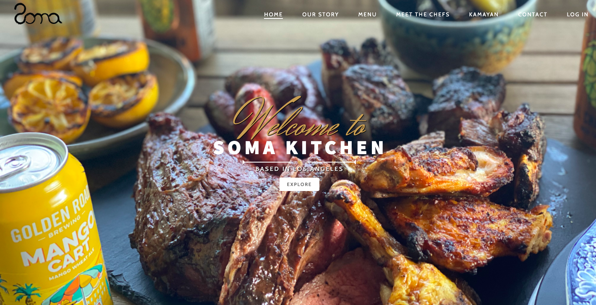
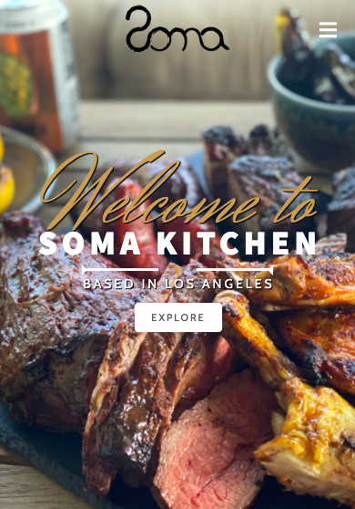

[![Contributors][contributors-shield]][contributors-url]
[![Issues][issues-shield]][issues-url]
[![MIT License][license-shield]][license-url]

 

  

  <h3 align="center">Soma Kitchen Responsive Website</h3>

  

     
    <a href="https://github.com/zcorpuz/soma_kitchen"><strong>Explore the docs »</strong></a>
     
     
    <a href="https://github.com/zcorpuz/soma_kitchen">View Demo</a>
    ·
    <a href="https://github.com/zcorpuz/soma_kitchen/issues">Report Bug</a>
  

  
<h2 style="display: inline-block">Table of Contents</h2>

  <ol>
    <li>
      <a href="#about-the-project">About The Project</a>
      <ul>
        <li><a href="#built-with">Demo</a></li>
      </ul>
      <ul>
        <li><a href="#built-with">Landing Page</a></li>
      </ul>
      <ul>
        <li><a href="#built-with">Built With</a></li>
      </ul>
    </li>
    <li><a href="#contributing">Roadmap/To-do</a></li>
    <li><a href="#license">License</a></li>
    <li><a href="#contact">Team</a></li>
    <li><a href="#acknowledgements">Acknowledgements</a></li>
  </ol>

## About the Project
This website is developed for our client, Soma Kitchen, based in Downtown Los Angeles, CA. We were asked to revamp a website with a modern touch to reflect the restaurant's new brand. By doing so, the client would be able to retain their customers so that they (the customers) are able to keep up-to-date with any new menu items from the restaurant. Thus, this will maintain (if not, increase) the retention rate of customers, which will keep the restaurant in business, especially during the COVID-19 pandemic. 

This application is built as one page, where if you scroll down, you will see all the sections, each with a different animated effect. This is due to the ScrollReveal JavaScript Library. You can also access each section with a navigation bar, in case you do not have time to scroll through the whole page. 

This application is responsive, where no matter what the screen size is (or device used), the application would still be presentable to the user. 

The reason we chose to partner with this client is because they were interested in increasing their online presence, especially during the COVID-19 pandemic. They knew they would not receive the same number of in-person clientele, so they wanted to establish a platform where they would connect to their clientele virtually. 

### Demo
This is the demo of the website: https://protected-everglades-09109.herokuapp.com/.

### Landing Page
This is how the site will look like when:

* opened on a desktop:
 

* opened on a mobile device:
 

### Built With 
* [Handlebars](https://handlebarsjs.com/)
* [Node.js](https://nodejs.org/en/)
* [Express.js](https://expressjs.com/)
* [MySQL](https://www.mysql.com/) 

## Roadmap / Todo
* See the [open issues](https://github.com/zcorpuz/soma_kitchen/issues) for a list of proposed features (and known issues).

## License
Distributed under the MIT License. See `LICENSE.md` for more information.

### Team
This website was done with a collaborative effort from Brandon Myhan, Carolina Aldana, Cattleya Pia, Maira Garcia, and Zach Corpuz.

## Acknowledgements
* [ScrollReveal](https://scrollrevealjs.org/)
* [Stripe API](https://stripe.com/docs)

[contributors-shield]: https://img.shields.io/github/contributors/zcorpuz/soma_kitchen.svg?style=for-the-badge
[contributors-url]: https://github.com/zcorpuz/soma_kitchen/graphs/contributors
[issues-shield]: https://img.shields.io/github/issues/zcorpuz/soma_kitchen.svg?style=for-the-badge
[issues-url]: https://github.com/zcorpuz/soma_kitchen/issues
[license-shield]: https://img.shields.io/github/license/zcorpuz/soma_kitchen.svg?style=for-the-badge
[license-url]: https://github.com/zcorpuz/soma_kitchen/master/LICENSE.md